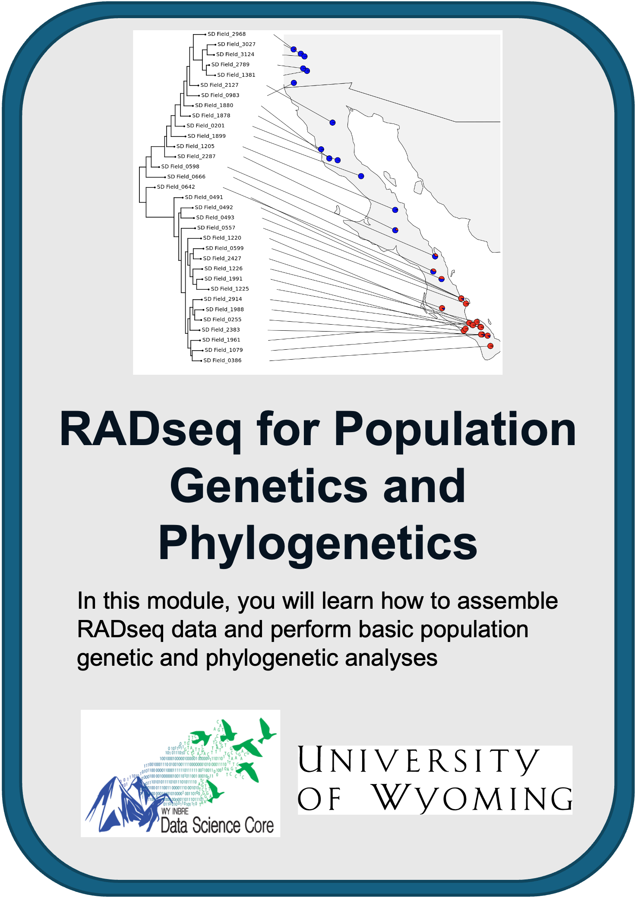
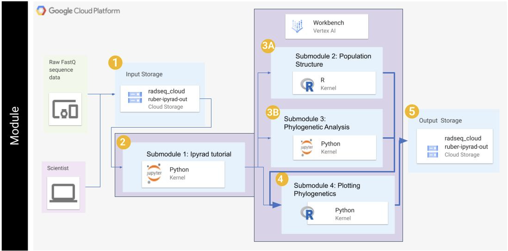

 
 
 

# RADseq for Population Genetics and Phylogenetics
---------------------------------

Wyoming INBRE Data Science Core

 

+ [Overview](#overview)
+ [Background](#background)
+ [Getting Started](#getting-started)
+ [Software Requirements](#software-requirements)
+ [Architecture Design](#architecture-design)
+ [Data](#data)
+ [Funding](#funding)
+ [License for Data](#license-for-data)

 
 
 

## **Overview**

In this tutorial, we show users how to assemble restriction-site associated DNA sequence (RADseq) data and perform some basic population genetic and phylogenetic analyses. All tutorials are presented as Jupyter notebooks.

This tutorial was developed to be executed on Google Cloud Platform, but can easily be adapted to other cloud, high performance compute, or even desktop/laptop computing systems.

 

## **Background**

Restriction site-Associated DNA sequencing (RADseq) is a high-throughput genotyping technique used in molecular biology and genomics. RADseq allows users to obtain sequence data from across the genome without sequencing the entire genome. There are many types of RADseq, including [double digest RADseq (ddRADseq)](https://doi.org/10.1371/journal.pone.0037135) which is what you will use in these tutorials.

RADseq is a powerful tool for studying genetic variation within populations, conducting population genetics, and developing genetic markers for diverse applications including human health, population variation, and evolution. 

Once you assemble the RADseq data, the subsequent three tutorials will teach population genetic and phylogenetic methods that can be applied to genomic data of any type, not just RADseq data. Population genetic methods similar to those we employ in these tutorials have been used to estimate [human ancestry and admixture](https://www.science.org/doi/10.1126/science.1243518). Identification of population structure can also be an important first step before running genome wide association (GWAS) studies, as population strcuture can confound some methods if it is not properly accounted for.

Finally, you will infer and plot phylogenetic trees in the final two submodules. Phylogenetic trees are employed widely in evolutionary biology, but also in disease modeling and studies of human evolution.

 

## **Getting Started**

To run this on Google Cloud Platform (GCP), you will need to have or create a Google account and GCP project.

Once you have these, navigate to [https://console.cloud.google.com/](https://console.cloud.google.com/), log in, and select the project you want to use from the dropdown in the upper left near the "Google Cloud" icon.

You will execute each tutorial in GCP's VertexAI Workbench. Follow the documentation [here](https://github.com/STRIDES/NIHCloudLabGCP/blob/main/docs/vertexai.md) to set up an instance, following steps 1-8 with the following specifications:

- Step 5: for "Region" select `us-east4-a`

- Step 7: for "Machine type" select `n2` and `n2-standard-8 (8 vCPUs, 32 GB RAM)`

- Additionally, in the Environment tab, you will need to select `Use a custom container` and enter `us-east4-docker.pkg.dev/nih-cl-shared-resources/nigms-sandbox/nigms-vertex-r-wy` in the box for "Docker container image" - **this is critical because this container includes necessary software for these tutorials**

Once you have created and started your instance, open a terminal window and clone this Github repository: `git clone https://github.com/wyoibc/RADseq_cloud_learn`. This should download all tutorial files into a directory called "RADseq_cloud_learn". Double click this directory, and then double click tutorial `.ipynb` files within to run through each.

There are submodules, each in a separate Jupyter notebook:

- RADseq data processing & assembly (using ipyrad): [1_ipyrad.ipynb](https://github.com/wyoibc/RADseq_cloud_learn/blob/master/1_ipyrad.ipynb) covers how to assemble RADseq data using the ipyrad pipeline
- Population structure in R: [2_popstructR.ipynb](https://github.com/wyoibc/RADseq_cloud_learn/blob/master/2_popstructR.ipynb) covers some basic population genetics analyses of the assembled RADseq data
- Phylogenetic tree inference: [3_phylo.ipynb](https://github.com/wyoibc/RADseq_cloud_learn/blob/master/3_phylo.ipynb) covers phylogenetic inference of the assembled RADseq data
- Plotting phylogenetic trees in R: [4_plot_phylo.ipynb](https://github.com/wyoibc/RADseq_cloud_learn/blob/master/4_plot_phylo.ipynb) covers plotting and manipulation of the phylogenetic trees estimated in the previous tutorial

 

 

* **When you are finished, stop your virtual machine by checking your notebook and pushing the stop button so you aren't charged for a machine that is sitting idle**

 

## **Software Requirements**

These turtorials run in Jupyter Notebooks. Modules 1 and 3 run in Python kernels and modules 2 and 4 run in R kernels.

In submodule 1, you will use mamba to install ipyrad. Alternate documentation on installation can be found [here](https://ipyrad.readthedocs.io/en/master/3-installation.html).

All necessary software for submodules 2-4 is included in a container that you will load (`us-east4-docker.pkg.dev/nih-cl-shared-resources/nigms-sandbox/nigms-vertex-r-wy`) as descibed in the Getting Started section, and so you will not need to download or install any software for these submodules. 

In submodules 2 and 4, you will run all analyses in R, using packages as described in these modules.

In submodule 3, you will run [IQtree](http://www.iqtree.org/) and the method SVDQuartets within the [PAUP](https://paup.phylosolutions.com/get-paup/) software package.

 

 

## **Data**

You will be working with empirical double digest RADseq data that I (Sean Harrington) generated as part of my PhD research. The data are for a species of rattlesnake, the red diamond rattlesnake (Crotalus ruber), that is distributed across the Baja California peninsula and into southern California. I am primarily an evolutionary biologist in my own research, and so these data are not biomedical, but all of the methods applied here are also used in biomedical contexts.

The data are single-end reads generated on an Illumina hiSeq. The published analyses of these data are available in [Harrington et al. 2018](https://onlinelibrary.wiley.com/doi/full/10.1111/jbi.13114). We have made the raw data available in a bucket that you will download within the tutorials, but the raw sequence data are also available in the NCBI SRA, as stated in the manuscript.

 

## **Funding**

This module was funded through an administrative supplement to the Wyoming IDeA Network of Biomedical Research Excellence from the National Institute of General Medical Sciences of the National Institutes of Health under grant number 3P20GM103432-23S1.

 

## **License for Data**

Text and materials are licensed under a Creative Commons CC-BY-NC-SA license. The license allows you to copy, remix and redistribute any of our publicly available materials, under the condition that you attribute the work (details in the license) and do not make profits from it.

This work is licensed under a [Creative Commons Attribution-NonCommercial-ShareAlike 4.0 International License](http://creativecommons.org/licenses/by-nc-sa/4.0/)

 

